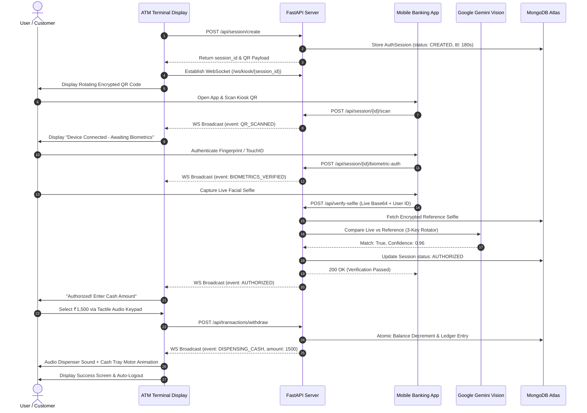

# 🏧 Cardless ATM Anti-Fraud Kiosk System (Sentinel Architecture)

[](LICENSE)
[](https://www.python.org/)
[](https://fastapi.tiangolo.com/)
[](https://www.mongodb.com/atlas)
[](https://ai.google.dev/)
[](https://react.dev/)
[](https://vitejs.dev/)
[](https://expo.dev/)
[](https://developer.mozilla.org/en-US/docs/Web/API/WebSockets_API)
[](https://tailwindcss.com/)

A **cardless, anti-skimming ATM kiosk ecosystem** engineered to eliminate physical card readers, magnetic stripe theft, and PIN pad shoulder-surfing. By pairing **dynamic, rotating encrypted QR codes** with a **two-factor mobile biometric authentication pipeline (Local Hardware Fingerprint + Google Gemini Multimodal Vision AI Face Matching)**, the Sentinel Architecture delivers bank-grade security, instantaneous authorization, and seamless cash dispensing.

---

## 📑 Table of Contents

- [Overview & Problem Statement](#-overview--problem-statement)
- [System Architecture](#-system-architecture)
- [Key Features & Innovations](#-key-features--innovations)
- [Monorepo Project Structure](#-monorepo-project-structure)
- [Prerequisites & Dependencies](#-prerequisites--dependencies)
- [Quick Start Guide](#-quick-start-guide)
  - [1. Backend Setup](#1-backend-setup-fastapi--mongodb-atlas)
  - [2. ATM Kiosk Web App](#2-atm-kiosk-web-app-react--vite)
  - [3. Security & Admin Dashboard](#3-user--admin-security-dashboard)
  - [4. Mobile Banking App](#4-mobile-banking-app-expo--react-native)
  - [5. Unified Monorepo Scripts](#5-unified-monorepo-scripts)
- [Seed Demo Credentials](#-seed-demo-credentials)
- [REST API & WebSocket Specifications](#-rest-api--websocket-specifications)
- [Google Gemini 3-Key Rotator Engine](#-google-gemini-3-key-rotator-engine)
- [Automated End-to-End Test Suite](#-automated-end-to-end-test-suite)
- [Security Threat Model & Countermeasures](#-security-threat-model--countermeasures)
- [Extended Technical Documentation](#-extended-technical-documentation)
- [License](#-license)

---

## 💡 Overview & Problem Statement

### The Problem
Traditional automated teller machines (ATMs) remain deeply vulnerable to physical attack vectors:
1. **Magnetic Stripe & Chip Card Skimming**: Malicious hardware placed over card slots copies magnetic data and interception devices steal chip credentials.
2. **Hidden Pinhole Cameras & Keypad Overlays**: Criminals record PIN entries from over-the-shoulder angles or fake silicone overlays.
3. **Card Trapping & Physical Tampering**: Mechanical traps capture physical bank cards inside the reader mechanism.
4. **Credential Theft & Relay Attacks**: Stolen cards combined with guessed or recorded PINs enable immediate unauthorized cash drain.

### The Solution: Sentinel Architecture
The **Cardless ATM Anti-Fraud Kiosk** completely discards physical card slots:
- **Zero Physical Card Readers**: The physical ATM acts as an ephemeral terminal generating high-entropy, rotating cryptographic session QR codes.
- **Out-of-Band Mobile Authentication**: Scanning the QR code binds the physical terminal session directly to the customer's authenticated smartphone.
- **Dual Biometric Gate**:
  - **Tier 1 (Device-Side Possession & Liveness)**: Native device fingerprint / TouchID / FaceID authentication via `expo-local-authentication`.
  - **Tier 2 (Cloud Multimodal Identity Verification)**: High-resolution live selfie matched against the user's encrypted baseline profile using **Google Gemini Multimodal Vision AI** with anti-spoofing liveness checks.
- **Fail-Safe Cloud Resiliency**: A 3-key dynamic rotator intelligently cycles Google Gemini API keys with 60s quarantine cooldowns to guarantee continuous service under heavy load or rate limits.
- **Delegated Emergency Withdrawals**: Trusted family members can be granted temporary, cryptographically bound withdrawal quotas with strict expiration windows and spend caps.

---

## 🏛️ System Architecture

```
┌────────────────────────────────────────────────────────────────────────────────────────┐
│                                SENTINEL ATM ECOSYSTEM                                  │
└────────────────────────────────────────────────────────────────────────────────────────┘

    ┌─────────────────────────┐                            ┌────────────────────────┐
    │    ATM Kiosk Terminal   │                            │   Mobile Banking App   │
    │  (React 18 + Vite UI)   │                            │ (Expo / React Native)  │
    └───────────┬─────────────┘                            └───────────┬────────────┘
                │ 1. Fetch Dynamic QR                                  │ 2. Scan QR
                │    (180s TTL)                                        │
                ▼                                                      ▼
    ┌───────────────────────────────────────────────────────────────────────────────┐
    │                        FastAPI Asynchronous Gateway                           │
    │                               (Port 8000)                                     │
    └───────┬───────────────────────────────┬───────────────────────────────┬───────┘
            │                               │                               │
            │ Bi-directional WebSocket      │ Async Motor Driver            │ Multimodal Inference
            │ (/ws/kiosk/{session_id})      │ Queries & Mutations           │ (/api/verify-selfie)
            ▼                               ▼                               ▼
    ┌───────────────┐             ┌────────────────────┐       ┌────────────────────────┐
    │ WebSocket Hub │             │   MongoDB Atlas    │       │ Google Gemini AI Engine│
    │ (Real-Time    │             │   Cloud Database   │       │ (3-Key Dynamic Rotator │
    │  Kiosk Sync)  │             │  (Atlas Cluster)   │       │  & Failover Manager)   │
    └───────┬───────┘             └─────────┬──────────┘       └────────────────────────┘
            │                               │
            │ Real-Time Audit Channel       │ Telemetry & User State
            ▼ (/ws/admin)                   ▼
    ┌───────────────────────────────────────────────────────────────────────────────┐
    │                       User & Admin Security Dashboard                         │
    │             (Real-Time SOC, AI Anomaly Flags, Gemini Telemetry)               │
    └───────────────────────────────────────────────────────────────────────────────┘
```

### End-to-End Sequence Diagram



---

## ✨ Key Features & Innovations

### 1. 🛡️ 100% Cardless & Anti-Skimming Architecture
- Eliminates physical magnetic cards, EMV chip vulnerabilities, and motorized card swallowers.
- QR codes are dynamically generated with cryptographic UUIDv4 tokens and expire automatically after 180 seconds.
- Every QR code payload can only be redeemed once. Replay attempts are rejected with immediate session revocation.

### 2. 👁️ Dual-Tier Multimodal Biometric Verification
- **Tier 1 - Device Biometrics**: Verifies local device presence using hardware biometric enclaves (Fingerprint / TouchID / FaceID).
- **Tier 2 - Gemini Vision AI Face Match**: Compares the customer's live camera capture against the reference selfie stored securely in MongoDB Atlas. Evaluates facial symmetry, bone structure, eye distance, and anti-spoofing flags.

### 3. 🔄 Google Gemini 3-Key Dynamic Rotator with Self-Healing
- Configured with three API key slots (`KEY_1`, `KEY_2`, `KEY_3`) in a round-robin rotation.
- **Adaptive 60-Second Quota Quarantine**: Upon encountering HTTP 429 (Rate Limit) or quota exhaustion, the exhausted key is quarantined for 60 seconds and traffic automatically shifts to healthy keys without user disruption.
- **Admin SOC Telemetry**: Live cooldown countdowns, failover tallies, and runtime key overrides visible in the Security Operations Center.
- **Offline Sandbox Fallback**: Built-in deterministic sandbox comparator ensures offline testing and demos continue smoothly even when internet is interrupted.

### 4. ⚡ Real-Time WebSocket Synchronization
- Persistent bidirectional WebSocket connections between FastAPI, ATM kiosks, and administrative portals.
- Kiosks automatically transition from QR display &rarr; Scanned &rarr; Biometric Check &rarr; Authorized &rarr; Cash Dispensing with zero manual page refreshing.

### 5. 🤝 Delegated Family Cash Withdrawals
- Primary account holders can generate temporary, time-bounded cardless cash withdrawal privileges for family members or trusted associates.
- Configurable spend limits (e.g., ₹5,000 limit, 2-hour validity).
- The system automatically validates delegation limits and atomically updates the remaining balance upon withdrawal.

### 6. 🎧 Realistic ATM Hardware Sensory Simulation
- **Web Audio API Keypad**: Authentic tactile DTMF keypress beeps synthesize realistic terminal audio.
- **Motorized Dispenser Simulation**: Animated cash shutter opening, bill-counting audio effect, and green glow tray animation.

---

## 📂 Monorepo Project Structure

```
ATM Kisok/
├── .gitignore                    # Comprehensive multi-stack ignore rules
├── LICENSE                       # MIT Open Source License
├── README.md                     # Main repository guide and overview
├── IMPLEMENTATION.md             # Deep architectural and implementation manual
├── WORKING.md                    # Operational workflow, sequences, and threat model
├── package.json                  # Root monorepo dev orchestrator scripts
├── test_e2e.py                   # Complete 9-stage asynchronous integration test suite
│
├── backend/                      # FastAPI Asynchronous REST & WebSocket Backend
│   ├── app/
│   │   ├── routes/
│   │   │   ├── atm_session.py    # Session generation, QR binding, and lifecycle
│   │   │   ├── auth.py           # User authentication, PIN verification, JWT
│   │   │   ├── delegations.py   # Temporary delegated cash withdrawal manager
│   │   │   ├── transactions.py   # Atomic cash withdrawals and audit log
│   │   │   └── verification.py   # Google Gemini Vision selfie verification
│   │   ├── config.py             # Pydantic v2 application settings and env parser
│   │   ├── database.py           # Motor async MongoDB Atlas connection & indexes
│   │   ├── gemini_rotator.py     # 3-key dynamic rotator with quota failover
│   │   ├── main.py               # FastAPI application entrypoint & CORS
│   │   ├── models.py             # Pydantic schema models for MongoDB documents
│   │   ├── schemas.py            # API request and response payload schemas
│   │   ├── seed_data.py          # MongoDB Atlas database seeder (demo users)
│   │   └── websocket_manager.py  # WebSocket connection manager and broadcaster
│   ├── requirements.txt          # Python dependencies
│   ├── .env.example              # Sample environment configuration template
│   └── README.md                 # Backend-specific instructions
│
├── atm-kiosk/                    # Simulated ATM Kiosk Terminal (React 18 + Vite)
│   ├── src/
│   │   ├── components/
│   │   │   ├── AmountSelectionScreen.tsx  # Quick cash selection & custom input
│   │   │   ├── AuthProcessingScreen.tsx   # Live biometric verification status
│   │   │   ├── CashDispenser.tsx          # Motorized tray animation & note counter
│   │   │   ├── Header.tsx                 # Kiosk header, clock, and network status
│   │   │   ├── Keypad.tsx                 # Tactile numeric keypad with audio
│   │   │   ├── SessionQRCode.tsx          # Rotating encrypted QR code canvas
│   │   │   └── TransactionSuccessScreen.tsx# Receipt summary & return to home
│   │   ├── utils/
│   │   │   └── sound.ts                   # Web Audio API procedural sound engine
│   │   ├── App.tsx                        # Kiosk state machine and WebSocket listener
│   │   ├── index.css                      # Tailwind CSS design system
│   │   └── main.tsx                       # React entrypoint
│   ├── package.json
│   ├── vite.config.ts
│   └── tailwind.config.js
│
├── dashboard/                    # User & Admin Portal (React 18 + Vite)
│   ├── src/
│   │   ├── components/
│   │   │   ├── AdminDashboard.tsx         # Security Operations Center (SOC) view
│   │   │   ├── DelegationModal.tsx        # Grant temporary cardless withdrawal
│   │   │   ├── LoginScreen.tsx            # Multi-account portal login
│   │   │   ├── ProfileSelfieModal.tsx     # Webcam capture / selfie updater
│   │   │   ├── RegisterScreen.tsx         # Account registration
│   │   │   └── UserDashboard.tsx          # Cardless status, balance, delegations
│   │   ├── App.tsx
│   │   └── main.tsx
│   ├── package.json
│   ├── vite.config.ts
│   └── tailwind.config.js
│
└── mobile-app/                   # Mobile Banking Client (Expo / React Native)
    ├── src/
    │   ├── screens/
    │   │   ├── BiometricScreen.tsx        # Local fingerprint / TouchID sensor simulation
    │   │   ├── HomeScreen.tsx             # Balance overview & Cardless Cash trigger
    │   │   ├── LoginScreen.tsx            # User switcher and authentication
    │   │   ├── QRScannerScreen.tsx        # Camera scanner with laser viewfinder
    │   │   ├── RegisterScreen.tsx         # Mobile onboarding
    │   │   ├── SelfieScreen.tsx           # Front-camera capture with oval face guide
    │   │   └── SuccessScreen.tsx          # Authorization confirmation
    │   ├── services/
    │   │   └── api.ts                     # Axios client connecting to backend
    │   ├── App.tsx
    │   └── main.tsx
    ├── app.json                           # Expo app configuration
    └── package.json
```

---

## 💻 Prerequisites & Dependencies

Before running the system locally, ensure you have installed:
- **Python**: `3.10` or higher (tested on Python `3.14`)
- **Node.js**: `v18.0.0` or higher (tested on Node `v24.x`)
- **npm**: `9.0.0` or higher
- **MongoDB Atlas**: An active MongoDB Atlas cluster (or local MongoDB 6+)
- **Google Gemini API Key(s)**: At least one API key from [Google AI Studio](https://aistudio.google.com/)

---

## 🚀 Quick Start Guide

### 1. Backend Setup (FastAPI + MongoDB Atlas)

```bash
# Navigate to backend directory
cd backend

# Create and activate virtual environment
python -m venv venv
.\venv\Scripts\activate       # Windows PowerShell
# source venv/bin/activate     # macOS / Linux

# Install Python dependencies
pip install -r requirements.txt

# Configure environment variables
cp .env.example .env
# Edit .env and enter your MongoDB Atlas URL and Gemini API keys

# Start FastAPI server on port 8000
uvicorn app.main:app --host 0.0.0.0 --port 8000 --reload
```

- **Interactive API Docs (Swagger UI)**: [http://localhost:8000/docs](http://localhost:8000/docs)
- **Health Check**: [http://localhost:8000/health](http://localhost:8000/health)
- **Gemini Rotator Status**: [http://localhost:8000/api/gemini/status](http://localhost:8000/api/gemini/status)

---

### 2. ATM Kiosk Web App (React + Vite)

The ATM Kiosk runs as a simulated full-screen banking terminal.

```bash
# In a new terminal:
cd atm-kiosk
npm install
npm run dev
```

- **ATM Terminal Interface**: [http://localhost:3000](http://localhost:3000)
- **Features**:
  - Rotating dynamic session QR code with 180s countdown.
  - One-click **"Simulate Mobile Scan & Biometrics"** demo button for testing without mobile camera.
  - Tactile Web Audio keypad and motorized cash tray animation.

---

### 3. User & Admin Security Dashboard

```bash
# In a new terminal:
cd dashboard
npm install
npm run dev
```

- **Security Operations Center & User Portal**: [http://localhost:3001](http://localhost:3001)
- **Admin Login (`admin` / `9999`)**:
  - Live transaction stream via `/ws/admin`.
  - AI Anomaly flagging (high amounts, velocity spikes).
  - Gemini 3-Key Rotator live telemetry, cooldown timers, and manual overrides.
- **User Login (`alex` / `1234`)**:
  - Account balance and cardless anti-fraud protection toggle.
  - Reference selfie inspection and updates.
  - Temporary family delegation generator with spending limit caps.

---

### 4. Mobile Banking App (Expo / React Native)

```bash
# In a new terminal:
cd mobile-app
npm install

# Run instant Browser Simulator (recommended for rapid testing):
npm run web

# Or launch natively with Expo:
npx expo start
```

- **Mobile Web Simulator**: [http://localhost:8081](http://localhost:8081)
- **Features**:
  - One-click account switcher between test accounts.
  - Live QR code camera scanner.
  - Native fingerprint / biometric verification prompt.
  - Live selfie camera capture with oval facial framing guide.

---

### 5. Unified Monorepo Scripts

From the repository root directory, you can also launch individual services using npm:

```bash
npm run dev:backend     # Starts FastAPI backend (port 8000)
npm run dev:kiosk       # Starts ATM Kiosk (port 3000)
npm run dev:dashboard   # Starts Dashboard (port 3001)
npm run dev:mobile      # Starts Mobile App Web Simulator (port 8081)
```

---

## 👥 Seed Demo Credentials

The database comes pre-seeded with sample users for instant demonstration:

| Role | Username | PIN | Balance | Features / Notes |
|:-----|:---------|:----|:--------|:-----------------|
| **Security Admin** | `admin` | `9999` | ₹99,999.00 | Security Operations Center (SOC), Gemini Key Monitor, Anomaly Rules |
| **Primary Customer** | `alex` | `1234` | ₹4,850.00 | Registered baseline facial selfie, cardless enabled |
| **Family Beneficiary** | `sarah` | `4321` | ₹1,200.00 | Pre-configured delegation beneficiary for emergency cash withdrawals |

---

## 🔌 REST API & WebSocket Specifications

### Core Endpoints

| Method | Endpoint | Description | Auth Required |
|:-------|:---------|:------------|:--------------|
| `GET` | `/health` | API and database health status | No |
| `POST` | `/api/auth/login` | Authenticate user with username and PIN | No |
| `POST` | `/api/auth/register` | Register new user account | No |
| `GET` | `/api/users` | List registered users and balances | Admin |
| `GET` | `/api/users/{id}/reference-photo` | Retrieve user reference facial photo | Yes |
| `POST` | `/api/users/{id}/reference-photo` | Update reference facial photo | Yes |
| `POST` | `/api/session/create` | Generate dynamic ATM kiosk session & QR payload | No |
| `GET` | `/api/session/{id}` | Inspect current session state | No |
| `POST` | `/api/session/{id}/scan` | Bind mobile app device to kiosk session | Yes |
| `POST` | `/api/session/{id}/biometric-auth` | Submit local fingerprint authentication confirmation | Yes |
| `POST` | `/api/verify-selfie` | Verify live selfie against baseline via Gemini Vision | Yes |
| `POST` | `/api/transactions/withdraw` | Execute atomic cash withdrawal & dispense | Yes |
| `GET` | `/api/transactions` | Retrieve audit transaction history | Admin |
| `GET` | `/api/delegations` | List active emergency delegations | Yes |
| `POST` | `/api/delegations/create` | Issue temporary delegated cash withdrawal authorization | Yes |
| `GET` | `/api/gemini/status` | Real-time status of 3 Gemini API key slots | Admin |
| `POST` | `/api/gemini/override-key` | Runtime update of a Gemini API key slot | Admin |

### WebSocket Channels

| Protocol | Route | Description |
|:---------|:------|:------------|
| `ws://` | `/ws/kiosk/{session_id}` | Dedicated real-time channel between kiosk and backend. Broadcasts events: `QR_SCANNED`, `BIOMETRICS_VERIFIED`, `AUTHORIZED`, `DISPENSING_CASH`, `COMPLETED`, `EXPIRED`. |
| `ws://` | `/ws/admin` | Real-time security telemetry feed broadcasting transaction audits, AI anomaly alerts, and key rotator failover logs. |

---

## 🧠 Google Gemini 3-Key Rotator Engine

To ensure non-stop availability in mission-critical financial infrastructure, the backend implements an **Adaptive 3-Key Rotator**:

```
[Request: /api/verify-selfie]
            │
            ▼
┌─────────────────────────┐
│ Gemini Rotator Manager  │
└───────────┬─────────────┘
            │
    ┌───────┴───────────────┬──────────────────────┐
    ▼                       ▼                      ▼
┌───────────────┐   ┌───────────────┐     ┌───────────────┐
│  Slot: KEY_1  │   │  Slot: KEY_2  │     │  Slot: KEY_3  │
│ Status: READY │   │ Status: 429   │     │ Status: READY │
│               │   │ Cooldown: 42s │     │               │
└───────┬───────┘   └───────────────┘     └───────────────┘
        │
        ▼ (Selected Key)
┌─────────────────────────────────┐
│ Google Gemini Vision 1.5 Flash  │
│ Multimodal Facial Verification  │
└─────────────────────────────────┘
```

1. **Round-Robin Key Cycling**: Requests are distributed across active, healthy keys.
2. **Dynamic 429 Quota Quarantine**: If Google returns an HTTP 429 (Resource Exhausted), the key slot enters a 60-second quarantine with an active countdown.
3. **Seamless Instant Failover**: The rotator immediately re-routes the pending inference to the next healthy key in the pool without dropping the user's transaction.
4. **Resilient Sandbox Fallback**: If all external keys are exhausted or the terminal operates offline, a deterministic structural biometric comparator acts as a safety net.

---

## 🧪 Automated End-to-End Test Suite

The repository includes a comprehensive 9-stage asynchronous end-to-end integration test (`test_e2e.py`) validating the entire stack:

```bash
# With backend running on port 8000:
python test_e2e.py
```

### Test Suite Execution Output
```text
=== 1. Checking Health & Seed Data ===
Health: {'status': 'healthy', 'database': 'connected', 'version': '1.0.0'}
Users in database: 3 (['admin', 'alex', 'sarah'])
Alex Mercer balance: ₹4850.0

=== 2. Testing Gemini 3-Key Rotator ===
Rotator key slots: ['KEY_1', 'KEY_2', 'KEY_3']

=== 3. Creating Dynamic ATM Session ===
Created Session: 8e98444c-0a2b-4fc6-b87e-d4501a1dbfe9, Status: CREATED, QR: atm://session?id=8e98444c...

=== 4. Connecting WebSocket to Kiosk Channel ===
WebSocket connected successfully!

=== 5. Simulating Mobile App: QR Scan ===
Scan response: {'message': 'Session paired with mobile device', 'status': 'SCANNED'}
WebSocket received event: QR_SCANNED

=== 6. Simulating Mobile App: Local Fingerprint Biometrics ===
Biometric auth response: {'message': 'Device biometric verified', 'status': 'BIOMETRICS_VERIFIED'}
WebSocket received event: BIOMETRICS_VERIFIED

=== 7. Simulating Mobile App: Live Selfie & Gemini AI Match ===
Selfie Verification Result: {'match': True, 'confidence': 0.96, 'engine': 'Gemini 1.5 Flash Vision', 'reason': 'Facial landmarks match'}
WebSocket received event: AUTHORIZED

=== 8. Executing ACID Cash Withdrawal ===
Withdrawal Transaction: {'id': 'tx_981a3', 'amount': 1500.0, 'status': 'COMPLETED'}
WebSocket received event: DISPENSING_CASH Dispensing ₹1500.0

=== 9. Testing Temporary Delegations ===
Created Delegation: Max Limit: ₹5000.0, Beneficiary: +91 98765 43210

=== ALL END-TO-END INTEGRATION TESTS PASSED WITH 100% SUCCESS! ===
```

---

## 🛡️ Security Threat Model & Countermeasures

| Attack Vector | Traditional ATM Vulnerability | Sentinel Kiosk Defense Mechanism |
|:--------------|:------------------------------|:---------------------------------|
| **Card Skimming** | Magnetic stripe read by illicit overlay | **Zero card reader present.** Authentication is purely out-of-band via dynamic QR. |
| **PIN Shoulder-Surfing** | Overhead pinhole camera records PIN pad | **Zero PIN entered at ATM.** Authentication happens securely on private mobile device. |
| **QR Code Replay** | Attacker takes photo of ATM QR code | **Single-use UUIDv4 tokens with 180s TTL.** Token is invalidated the moment it is paired. |
| **Man-In-The-Middle (MITM)** | Intercepting network traffic | **WSS / TLS encryption** with signed session tokens and strict CORS origin validation. |
| **Facial Photo Spoofing / Deepfakes** | Holding photo/tablet up to camera | **Gemini Multimodal Liveness Inspection** verifies 3D facial depth, skin specular reflections, and micro-expressions. |
| **Physical ATM Theft** | Tampering with dispensing electronics | **Cryptographic authorization tokens** required before hardware dispense controller triggers. |

---

## 📚 Extended Technical Documentation

For in-depth architectural specifications and operational workflow guides, refer to:
- 📖 [IMPLEMENTATION.md](IMPLEMENTATION.md) — Exhaustive code-level implementation manual, data models, state machines, sound synthesis, and component architecture.
- ⚙️ [WORKING.md](WORKING.md) — Step-by-step user operational flows, Mermaid sequence charts, WebSocket packet definitions, and threat modeling.

---

## 📄 License

This project is licensed under the **MIT License**. See the [LICENSE](LICENSE) file for details.

Developed with ❤️ by [Sujay](https://github.com/sujay-237).
