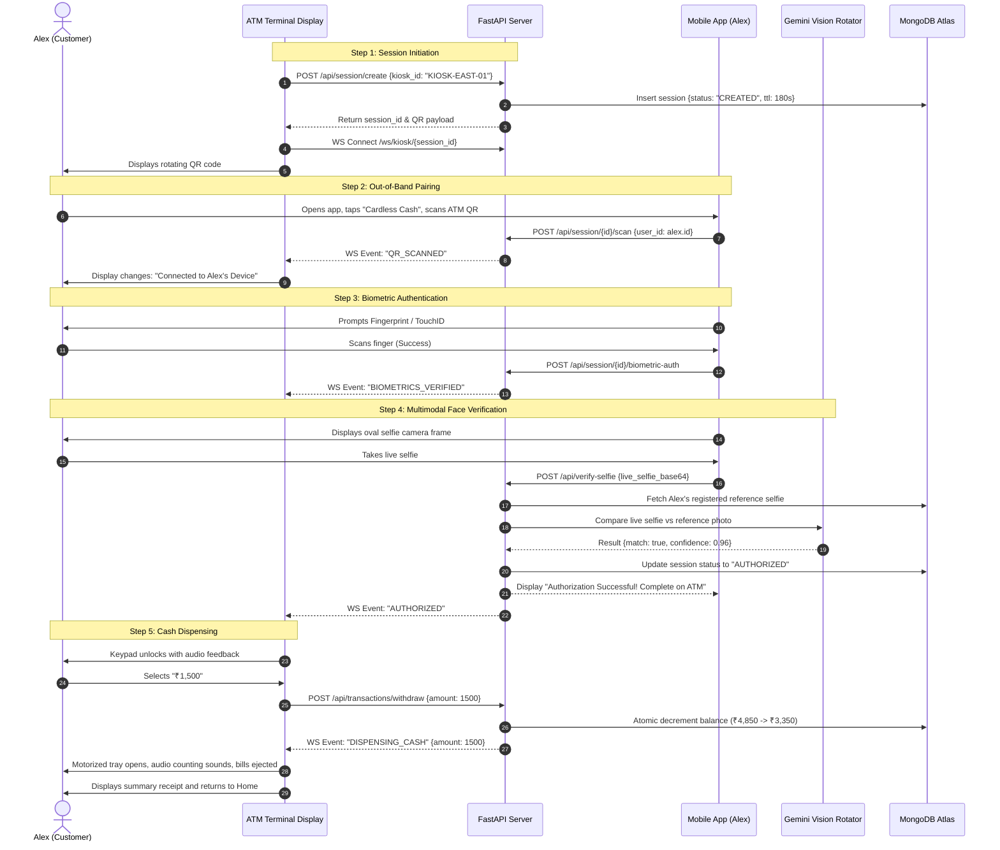
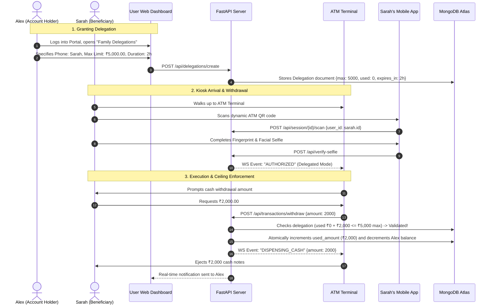
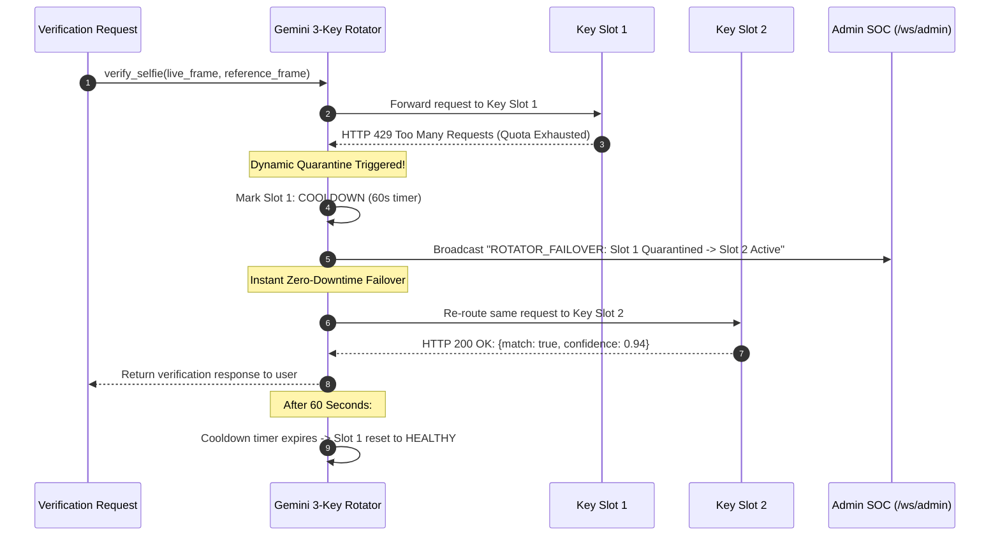

# 🔄 System Operational Mechanics & Workflow Manual (WORKING.md)

This document provides a complete operational guide to the **Cardless ATM Anti-Fraud Kiosk System (Sentinel Architecture)**. It describes end-to-end user journeys, system state transitions, real-time WebSocket protocol payloads, and threat mitigation mechanisms.

---

## 📑 Table of Contents

- [1. Operational Summary](#1-operational-summary)
- [2. End-to-End User Journeys](#2-end-to-end-user-journeys)
  - [Journey 1: Primary User Cardless Cash Withdrawal](#journey-1-primary-user-cardless-cash-withdrawal)
  - [Journey 2: Delegated Emergency Family Withdrawal](#journey-2-delegated-emergency-family-withdrawal)
  - [Journey 3: Gemini 3-Key Rotator Failover Recovery](#journey-3-gemini-3-key-rotator-failover-recovery)
  - [Journey 4: Anti-Fraud SOC Telemetry & Anomaly Triggering](#journey-4-anti-fraud-soc-telemetry--anomaly-triggering)
- [3. System State Machine & Lifecycle](#3-system-state-machine--lifecycle)
- [4. WebSocket Protocol Specification](#4-websocket-protocol-specification)
  - [4.1 Kiosk Channel (`/ws/kiosk/{session_id}`)](#41-kiosk-channel-wskiosksession_id)
  - [4.2 Admin Channel (`/ws/admin`)](#42-admin-channel-wsadmin)
- [5. Threat Analysis & Security Mitigations](#5-threat-analysis--security-mitigations)
- [6. Troubleshooting & Diagnostics Playbook](#6-troubleshooting--diagnostics-playbook)

---

## 1. Operational Summary

The Sentinel Architecture replaces traditional card-reading ATMs with an **ephemeral out-of-band authentication model**:

```
[1. ATM Terminal]           [2. Mobile App]               [3. Cloud AI Engine]        [4. Cash Dispenser]
  Dynamic QR Code  ───▶  Biometric Fingerprint  ───▶  Gemini Vision Face Match  ───▶  Physical Cash Ejected
   (180s Timeout)          & Live Selfie Capture       (3-Key Dynamic Rotator)        (Atomic Decrement)
```

By decoupling session initiation (at the public terminal) from identity verification (on the customer's private personal device), the system achieves:
1. **Zero physical contact surface** for card skimmers or magnetic shims.
2. **Zero PIN exposure** to over-the-shoulder cameras or fake keypad overlays.
3. **Multi-factor certainty** uniting device ownership, biometric signature, and cloud facial verification.

---

## 2. End-to-End User Journeys

### Journey 1: Primary User Cardless Cash Withdrawal



---

### Journey 2: Delegated Emergency Family Withdrawal

In emergency situations, an account holder (e.g., Alex) can grant a family member (e.g., Sarah) temporary cardless withdrawal rights up to a pre-defined spending cap.



---

### Journey 3: Gemini 3-Key Rotator Failover Recovery

To guarantee 99.99% verification uptime under cloud rate limits, the system operates an autonomous self-healing key pool:



---

### Journey 4: Anti-Fraud SOC Telemetry & Anomaly Triggering

The backend inspects every transaction against fraud heuristics and broadcasts alerts immediately to the Admin Security Operations Center (SOC).

```
   [Withdrawal Event Triggered]
                 │
                 ▼
 ┌───────────────────────────────┐
 │ Heuristic Rules Engine        │
 ├───────────────────────────────┤
 │ 1. Amount > ₹10,000.00?       │ ──▶ Flag: HIGH_AMOUNT_WITHDRAWAL
 │ 2. Velocity > 3 tx in 15 min? │ ──▶ Flag: RAPID_VELOCITY_SPIKE
 │ 3. Device mismatch?           │ ──▶ Flag: UNKNOWN_DEVICE_FINGERPRINT
 └───────────────┬───────────────┘
                 │
                 ▼
 ┌───────────────────────────────┐
 │ Admin WebSocket (/ws/admin)   │
 └───────────────┬───────────────┘
                 │
                 ▼
 ┌────────────────────────────────────────────────────────┐
 │ Admin Dashboard SOC Alert:                             │
 │ 🚨 [CRITICAL ANOMALY DETECTED]                         │
 │ User: Alex Mercer | Amount: ₹15,000.00                 │
 │ Reason: Withdrawal exceeds single-transaction ceiling  │
 └────────────────────────────────────────────────────────┘
```

---

## 3. System State Machine & Lifecycle

The session model strictly prevents unauthorized operations through an explicit Finite State Machine (FSM):

```
       ┌──────────────────────────────┐
       │           CREATED            │
       │ (Session initialized on ATM) │
       └──────────────┬───────────────┘
                      │ POST /api/session/{id}/scan
                      ▼
       ┌──────────────────────────────┐
       │           SCANNED            │
       │ (Mobile device paired to ATM)│
       └──────────────┬───────────────┘
                      │ POST /api/session/{id}/biometric-auth
                      ▼
       ┌──────────────────────────────┐
       │     BIOMETRICS_VERIFIED      │
       │  (Device hardware verified)  │
       └──────────────┬───────────────┘
                      │ POST /api/verify-selfie (Match >= 0.85)
                      ▼
       ┌──────────────────────────────┐
       │          AUTHORIZED          │
       │  (ATM unlocks cash keypad)   │
       └──────────────┬───────────────┘
                      │ POST /api/transactions/withdraw
                      ▼
       ┌──────────────────────────────┐
       │          COMPLETED           │
       │    (Cash dispensed, closed)  │
       └──────────────────────────────┘

  * Exception States:
    - [EXPIRED]: If TTL exceeds 180 seconds at any stage.
    - [REJECTED]: If facial match confidence < 0.85 or liveness failed.
    - [CANCELLED]: If customer taps "Cancel" on mobile or ATM terminal.
```

---

## 4. WebSocket Protocol Specification

All real-time communication occurs using lightweight JSON packets over persistent WebSocket connections.

### 4.1 Kiosk Channel (`/ws/kiosk/{session_id}`)

#### Outbound Events (Server &rarr; Kiosk)

##### 1. `QR_SCANNED`
Broadcast when the customer scans the dynamic QR code with their mobile banking app:
```json
{
  "event": "QR_SCANNED",
  "status": "SCANNED",
  "session_id": "8e98444c-0a2b-4fc6-b87e-d4501a1dbfe9",
  "user_name": "Alex Mercer",
  "timestamp": "2026-10-07T13:45:00.123Z"
}
```

##### 2. `BIOMETRICS_VERIFIED`
Broadcast when local device biometric authentication (Fingerprint / FaceID) succeeds:
```json
{
  "event": "BIOMETRICS_VERIFIED",
  "status": "BIOMETRICS_VERIFIED",
  "biometric_type": "FINGERPRINT",
  "timestamp": "2026-10-07T13:45:04.456Z"
}
```

##### 3. `AUTHORIZED`
Broadcast when Google Gemini Vision verifies the live selfie against the reference profile:
```json
{
  "event": "AUTHORIZED",
  "status": "AUTHORIZED",
  "confidence": 0.96,
  "user_id": "usr_alex_001",
  "available_balance": 4850.00,
  "is_delegated": false,
  "timestamp": "2026-10-07T13:45:08.789Z"
}
```

##### 4. `DISPENSING_CASH`
Broadcast when cash withdrawal is authorized and balance is atomically deducted:
```json
{
  "event": "DISPENSING_CASH",
  "status": "DISPENSING",
  "amount": 150.00,
  "transaction_id": "tx_c8914b",
  "new_balance": 4700.00,
  "timestamp": "2026-10-07T13:45:15.012Z"
}
```

##### 5. `SESSION_EXPIRED`
Broadcast when the 180-second session window expires:
```json
{
  "event": "SESSION_EXPIRED",
  "status": "EXPIRED",
  "reason": "QR session timed out. New session created.",
  "timestamp": "2026-10-07T13:48:00.000Z"
}
```

---

### 4.2 Admin Channel (`/ws/admin`)

#### Real-Time Telemetry Packets

##### 1. `TRANSACTION_LOG`
```json
{
  "type": "TRANSACTION_LOG",
  "data": {
    "id": "tx_c8914b",
    "kiosk_id": "KIOSK-EAST-01",
    "user_id": "usr_alex_001",
    "username": "alex",
    "amount": 150.00,
    "status": "COMPLETED",
    "anomaly_flag": false,
    "created_at": "2026-10-07T13:45:15.012Z"
  }
}
```

##### 2. `ROTATOR_TELEMETRY`
```json
{
  "type": "ROTATOR_TELEMETRY",
  "data": {
    "active_slot": "KEY_2",
    "slots": [
      {"slot_id": "KEY_1", "status": "COOLDOWN", "cooldown_remaining_sec": 42, "fail_count": 1},
      {"slot_id": "KEY_2", "status": "HEALTHY", "cooldown_remaining_sec": 0, "fail_count": 0},
      {"slot_id": "KEY_3", "status": "HEALTHY", "cooldown_remaining_sec": 0, "fail_count": 0}
    ]
  }
}
```

---

## 5. Threat Analysis & Security Mitigations

```
┌─────────────────────────────────┬───────────────────────────────────────────────────────┐
│ Attack Vector                   │ Sentinel Architectural Defense                        │
├─────────────────────────────────┼───────────────────────────────────────────────────────┤
│ Physical Magnetic Skimmers      │ Zero physical card slots exist on the kiosk.          │
│ Shims on EMV Chip Readers       │ Zero chip reader mechanisms exist on the kiosk.       │
│ Camera Pinhole PIN Recording    │ Zero PINs are typed on physical ATM hardware.         │
│ Fake Keypad Overlays            │ Numeric input is only unlocked after biometric match. │
│ Photo of ATM QR Code Stolen     │ Single-use UUID tokens with 180-second hard TTL.      │
│ Pre-Recorded Video / Deepfakes  │ Multimodal Gemini Vision checks skin texture & depth. │
│ Stolen Smartphone Attack        │ Requires phone lock + hardware fingerprint + selfie.  │
│ Network Sniffing & Replays      │ TLS/HTTPS and WSS WebSocket transport encryption.     │
└─────────────────────────────────┴───────────────────────────────────────────────────────┘
```

---

## 6. Troubleshooting & Diagnostics Playbook

### 1. Kiosk Displays "WebSocket Disconnected"
- **Cause**: Backend server is not running on port 8000 or CORS origin is blocked.
- **Remedy**:
  1. Confirm FastAPI is running: `curl http://localhost:8000/health`.
  2. Verify terminal connection settings in `atm-kiosk/src/App.tsx`.

### 2. Live Selfie Fails Verification
- **Cause**: Lighting is too dim, face is off-center, or Google Gemini keys are inactive.
- **Remedy**:
  1. Check Gemini Rotator health via `http://localhost:8000/api/gemini/status`.
  2. Ensure the user's reference photo exists via `GET /api/users/{id}/reference-photo`.
  3. Ensure face is centered inside the mobile camera oval guide.

### 3. Insufficient Balance Error on Withdrawal
- **Cause**: Withdrawal amount exceeds account balance or active delegation limit.
- **Remedy**:
  1. Check account balance on the User Dashboard.
  2. If using family delegation, ensure the amount does not exceed the remaining delegated quota.

### 4. Running the E2E Integration Suite
To verify all system subsystems and network links in one command:
```bash
python test_e2e.py
```
If all 9 stages output green checkmarks, the entire ecosystem is operating in optimal health.
